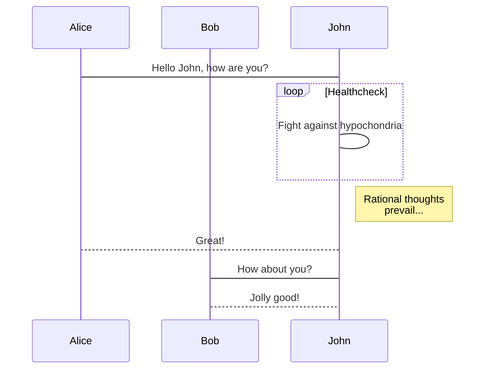
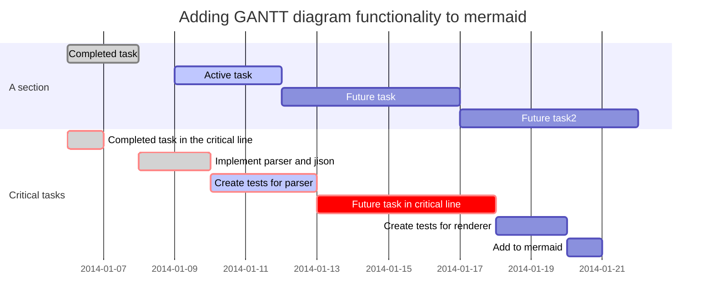

Tables, Charts, Code Blocks, Mermaid
<!--more-->

# Tables

## Align

|-----------------+------------+-----------------+----------------|
| Default aligned |Left aligned| Center aligned  | Right aligned  |
|-----------------|:-----------|:---------------:|---------------:|
| First body part |Second cell | Third cell      | fourth cell    |
| Second line     |foo         | **strong**      | baz            |
| Third line      |quux        | baz             | bar            |
|-----------------+------------+-----------------+----------------|
| Second body     |            |                 |                |
| 2 line          |            |                 |                |
|=================+============+=================+================|
| Footer row      |            |                 |                |
|-----------------+------------+-----------------+----------------|


**markdown:**

    |-----------------+------------+-----------------+----------------|
    | Default aligned |Left aligned| Center aligned  | Right aligned  |
    |-----------------|:-----------|:---------------:|---------------:|
    | First body part |Second cell | Third cell      | fourth cell    |
    | Second line     |foo         | **strong**      | baz            |
    | Third line      |quux        | baz             | bar            |
    |-----------------+------------+-----------------+----------------|
    | Second body     |            |                 |                |
    | 2 line          |            |                 |                |
    |=================+============+=================+================|
    | Footer row      |            |                 |                |
    |-----------------+------------+-----------------+----------------|

---

|---
| Default aligned | Left aligned | Center aligned | Right aligned
|-|:-|:-:|-:
| First body part | Second cell | Third cell | fourth cell
| Second line |foo | **strong** | baz
| Third line |quux | baz | bar
|---
| Second body
| 2 line
|===
| Footer row

**markdown:**

    |---
    | Default aligned | Left aligned | Center aligned | Right aligned
    |-|:-|:-:|-:
    | First body part | Second cell | Third cell | fourth cell
    | Second line |foo | **strong** | baz
    | Third line |quux | baz | bar
    |---
    | Second body
    | 2 line
    |===
    | Footer row

## Table With Images

| Model | iPhone 6S | iPhone 6S Plus | iPhone SE | iPhone 7 | iPhone 7 Plus | iPhone 8 | iPhone 8 Plus | iPhone X |
| ----- | --------- | -------------- | --------- | -------- | ------------- | -------- | ------------- | -------- |
| Picture |  |  |  |  |  |  |  |  |
| Initial release operating system | iOS 9.0 | iOS 9.0 | iOS 9.3 | iOS 10.0 | iOS 10.0 | iOS 11.0 | iOS 11.0 | iOS 11.0.1 |
| Display  | 4.7 in (120 mm), 4.1 in (100 mm) by 2.3 in (58 mm), 16:9 aspect ratio, aluminosilicate glass covered 16,777,216-color (24-bit), IPS LCD screen, 1,334 × 750 px screen resolution at 326 ppi, 1400:1 contrast ratio, 500 ​cd⁄m² max brightness, LED backlight and fingerprint-resistant oleophobic coating | 5.5 in (140 mm), 4.8 in (120 mm) by 2.7 in (69 mm), 16:9 aspect ratio, aluminosilicate glass covered 16,777,216-color (24-bit), IPS LCD screen, 1,920 × 1,080 px (Full HD) screen resolution at 401 ppi, 1300:1 contrast ratio, 500 ​cd⁄m² max brightness, LED backlight and fingerprint-resistant oleophobic coating | 4 in (100 mm), 3.5 in (89 mm) by 1.9 in (48 mm), 71:40 (~16:9) aspect ratio, aluminosilicate glass covered 16,777,216-color (24-bit), IPS LCD screen, 1,136 × 640 px (WSVGA) screen resolution at 326 ppi, pixel size 78 µm, 800:1 contrast ratio, 500 ​cd⁄m² max brightness, LED backlight and fingerprint-resistant oleophobic coating | In addition to 6S: 625 ​cd⁄m² max brightness | In addition to 6S Plus: 625 ​cd⁄m² max brightness | In addition to 7: True Tone display | In addition to 7 Plus: True Tone display | 5.8 in (150 mm), 5.31 in (135 mm) by 2.45 in (62 mm), ~19.5:9 aspect ratio, aluminosilicate glass covered 16,777,216-color (24-bit), AMOLED screen, 2,436 × 1,125 px screen resolution at 458 ppi, 1,000,000:1 contrast ratio, 625 ​cd⁄m² max brightness, fingerprint-resistant oleophobic coating, True Tone display, Dolby Vision and HDR10 support |

> From Wikipedia, the free encyclopedia

## Table With Long Text

| Language | Demo |
| -------- | ---- |
| C | printf("hello,world!hello,world!hello,world!hello,world!hello,world!hello,world!hello,world!hello,world!hello,world!hello,world!hello,world!hello,world!hello,world!"); |
| C++ | std::cout<<"hello,world!hello,world!hello,world!hello,world!hello,world!hello,world!hello,world!hello,world!hello,world!hello,world!hello,world!hello,world!hello,world!"<<std::endl; |
| Java | System.out.println("hello,world!hello,world!hello,world!hello,world!hello,world!hello,world!hello,world!hello,world!hello,world!hello,world!hello,world!hello,world!hello,world!"); |
| JavaScript | console.log('hello,world!hello,world!hello,world!hello,world!hello,world!hello,world!hello,world!hello,world!hello,world!hello,world!hello,world!hello,world!hello,world!'); |

# Chart
```chart
{
  "type": "line",
  "data": {
    "labels": [
      "January",
      "February",
      "March",
      "April",
      "May",
      "June",
      "July"
    ],
    "datasets": [
      {
        "label": "# of bugs",
        "fill": false,
        "lineTension": 0.1,
        "backgroundColor": "rgba(75,192,192,0.4)",
        "borderColor": "rgba(75,192,192,1)",
        "borderCapStyle": "butt",
        "borderDash": [],
        "borderDashOffset": 0,
        "borderJoinStyle": "miter",
        "pointBorderColor": "rgba(75,192,192,1)",
        "pointBackgroundColor": "#fff",
        "pointBorderWidth": 1,
        "pointHoverRadius": 5,
        "pointHoverBackgroundColor": "rgba(75,192,192,1)",
        "pointHoverBorderColor": "rgba(220,220,220,1)",
        "pointHoverBorderWidth": 2,
        "pointRadius": 1,
        "pointHitRadius": 10,
        "data": [
          65,
          59,
          80,
          81,
          56,
          55,
          40
        ],
        "spanGaps": false
      }
    ]
  },
  "options": {}
}
```

You need set `chart: true` in the *_config.yml* or the markdown’s front matter to **enable** it.
{:.warning}

[Documentation](https://tianqi.name/jekyll-TeXt-theme/docs/en/markdown-enhancements#chart)

## Line Chart

```chart
{
  "type": "line",
  "data": {
    "labels": [
      "January",
      "February",
      "March",
      "April",
      "May",
      "June",
      "July"
    ],
    "datasets": [
      {
        "label": "# of bugs",
        "fill": false,
        "lineTension": 0.1,
        "backgroundColor": "rgba(75,192,192,0.4)",
        "borderColor": "rgba(75,192,192,1)",
        "borderCapStyle": "butt",
        "borderDash": [],
        "borderDashOffset": 0,
        "borderJoinStyle": "miter",
        "pointBorderColor": "rgba(75,192,192,1)",
        "pointBackgroundColor": "#fff",
        "pointBorderWidth": 1,
        "pointHoverRadius": 5,
        "pointHoverBackgroundColor": "rgba(75,192,192,1)",
        "pointHoverBorderColor": "rgba(220,220,220,1)",
        "pointHoverBorderWidth": 2,
        "pointRadius": 1,
        "pointHitRadius": 10,
        "data": [
          65,
          59,
          80,
          81,
          56,
          55,
          40
        ],
        "spanGaps": false
      }
    ]
  },
  "options": {}
}
```

**markdown:**

    ```chart
    {
      "type": "line",
      "data": {
        "labels": [
          "January",
          "February",
          "March",
          "April",
          "May",
          "June",
          "July"
        ],
        "datasets": [
          {
            "label": "# of bugs",
            "fill": false,
            "lineTension": 0.1,
            "backgroundColor": "rgba(75,192,192,0.4)",
            "borderColor": "rgba(75,192,192,1)",
            "borderCapStyle": "butt",
            "borderDash": [],
            "borderDashOffset": 0,
            "borderJoinStyle": "miter",
            "pointBorderColor": "rgba(75,192,192,1)",
            "pointBackgroundColor": "#fff",
            "pointBorderWidth": 1,
            "pointHoverRadius": 5,
            "pointHoverBackgroundColor": "rgba(75,192,192,1)",
            "pointHoverBorderColor": "rgba(220,220,220,1)",
            "pointHoverBorderWidth": 2,
            "pointRadius": 1,
            "pointHitRadius": 10,
            "data": [
              65,
              59,
              80,
              81,
              56,
              55,
              40
            ],
            "spanGaps": false
          }
        ]
      },
      "options": {}
    }
    ```

## Bar Chart

```chart
{
  "type": "bar",
  "data": {
  "labels": [
    "Red",
    "Blue",
    "Yellow",
    "Green",
    "Purple",
    "Orange"
  ],
  "datasets": [
    {
    "label": "# of Votes",
    "data": [
      12,
      19,
      3,
      5,
      2,
      3
    ],
    "backgroundColor": [
      "rgba(255, 99, 132, 0.2)",
      "rgba(54, 162, 235, 0.2)",
      "rgba(255, 206, 86, 0.2)",
      "rgba(75, 192, 192, 0.2)",
      "rgba(153, 102, 255, 0.2)",
      "rgba(255, 159, 64, 0.2)"
    ],
    "borderColor": [
      "rgba(255,99,132,1)",
      "rgba(54, 162, 235, 1)",
      "rgba(255, 206, 86, 1)",
      "rgba(75, 192, 192, 1)",
      "rgba(153, 102, 255, 1)",
      "rgba(255, 159, 64, 1)"
    ],
    "borderWidth": 1
    }
  ]
  },
  "options": {}
}
```

**markdown:**

    ```chart
    {
      "type": "bar",
      "data": {
      "labels": [
        "Red",
        "Blue",
        "Yellow",
        "Green",
        "Purple",
        "Orange"
      ],
      "datasets": [
        {
        "label": "# of Votes",
        "data": [
          12,
          19,
          3,
          5,
          2,
          3
        ],
        "backgroundColor": [
          "rgba(255, 99, 132, 0.2)",
          "rgba(54, 162, 235, 0.2)",
          "rgba(255, 206, 86, 0.2)",
          "rgba(75, 192, 192, 0.2)",
          "rgba(153, 102, 255, 0.2)",
          "rgba(255, 159, 64, 0.2)"
        ],
        "borderColor": [
          "rgba(255,99,132,1)",
          "rgba(54, 162, 235, 1)",
          "rgba(255, 206, 86, 1)",
          "rgba(75, 192, 192, 1)",
          "rgba(153, 102, 255, 1)",
          "rgba(255, 159, 64, 1)"
        ],
        "borderWidth": 1
        }
      ]
      },
      "options": {}
    }
    ```

## Radar Chart

```chart
{
  "type": "radar",
  "data": {
    "labels": [
      "Eating",
      "Drinking",
      "Sleeping",
      "Designing",
      "Coding",
      "Cycling",
      "Running"
    ],
    "datasets": [
      {
        "label": "My First dataset",
        "backgroundColor": "rgba(179,181,198,0.2)",
        "borderColor": "rgba(179,181,198,1)",
        "pointBackgroundColor": "rgba(179,181,198,1)",
        "pointBorderColor": "#fff",
        "pointHoverBackgroundColor": "#fff",
        "pointHoverBorderColor": "rgba(179,181,198,1)",
        "data": [
          65,
          59,
          90,
          81,
          56,
          55,
          40
        ]
      },
      {
        "label": "My Second dataset",
        "backgroundColor": "rgba(255,99,132,0.2)",
        "borderColor": "rgba(255,99,132,1)",
        "pointBackgroundColor": "rgba(255,99,132,1)",
        "pointBorderColor": "#fff",
        "pointHoverBackgroundColor": "#fff",
        "pointHoverBorderColor": "rgba(255,99,132,1)",
        "data": [
          28,
          48,
          40,
          19,
          96,
          27,
          100
        ]
      }
    ]
  },
  "options": {}
}
```

**markdown:**

    ```chart
    {
      "type": "radar",
      "data": {
        "labels": [
          "Eating",
          "Drinking",
          "Sleeping",
          "Designing",
          "Coding",
          "Cycling",
          "Running"
        ],
        "datasets": [
          {
            "label": "My First dataset",
            "backgroundColor": "rgba(179,181,198,0.2)",
            "borderColor": "rgba(179,181,198,1)",
            "pointBackgroundColor": "rgba(179,181,198,1)",
            "pointBorderColor": "#fff",
            "pointHoverBackgroundColor": "#fff",
            "pointHoverBorderColor": "rgba(179,181,198,1)",
            "data": [
              65,
              59,
              90,
              81,
              56,
              55,
              40
            ]
          },
          {
            "label": "My Second dataset",
            "backgroundColor": "rgba(255,99,132,0.2)",
            "borderColor": "rgba(255,99,132,1)",
            "pointBackgroundColor": "rgba(255,99,132,1)",
            "pointBorderColor": "#fff",
            "pointHoverBackgroundColor": "#fff",
            "pointHoverBorderColor": "rgba(255,99,132,1)",
            "data": [
              28,
              48,
              40,
              19,
              96,
              27,
              100
            ]
          }
        ]
      },
      "options": {}
    }
    ```

## Polar Area Chart

```chart
{
  "type": "polarArea",
  "data": {
    "datasets": [
      {
        "data": [
          11,
          16,
          7,
          3,
          14
        ],
        "backgroundColor": [
          "#FF6384",
          "#4BC0C0",
          "#FFCE56",
          "#E7E9ED",
          "#36A2EB"
        ],
        "label": "My dataset"
      }
    ],
    "labels": [
      "Red",
      "Green",
      "Yellow",
      "Grey",
      "Blue"
    ]
  },
  "options": {}
}
```

**markdown:**

    ```chart
    {
      "type": "polarArea",
      "data": {
        "datasets": [
          {
            "data": [
              11,
              16,
              7,
              3,
              14
            ],
            "backgroundColor": [
              "#FF6384",
              "#4BC0C0",
              "#FFCE56",
              "#E7E9ED",
              "#36A2EB"
            ],
            "label": "My dataset"
          }
        ],
        "labels": [
          "Red",
          "Green",
          "Yellow",
          "Grey",
          "Blue"
        ]
      },
      "options": {}
    }
    ```

## Pie Chart

```chart
{
  "type": "pie",
  "data": {
    "labels": [
      "Red",
      "Blue",
      "Yellow"
    ],
    "datasets": [
      {
        "data": [
          300,
          50,
          100
        ],
        "backgroundColor": [
          "#FF6384",
          "#36A2EB",
          "#FFCE56"
        ],
        "hoverBackgroundColor": [
          "#FF6384",
          "#36A2EB",
          "#FFCE56"
        ]
      }
    ]
  },
  "options": {}
}
```

**markdown:**

    ```chart
    {
      "type": "pie",
      "data": {
        "labels": [
          "Red",
          "Blue",
          "Yellow"
        ],
        "datasets": [
          {
            "data": [
              300,
              50,
              100
            ],
            "backgroundColor": [
              "#FF6384",
              "#36A2EB",
              "#FFCE56"
            ],
            "hoverBackgroundColor": [
              "#FF6384",
              "#36A2EB",
              "#FFCE56"
            ]
          }
        ]
      },
      "options": {}
    }
    ```

## Doughnut Chart

```chart
{
  "type": "doughnut",
  "data": {
    "labels": [
      "Red",
      "Blue",
      "Yellow"
    ],
    "datasets": [
      {
        "data": [
          300,
          50,
          100
        ],
        "backgroundColor": [
          "#FF6384",
          "#36A2EB",
          "#FFCE56"
        ],
        "hoverBackgroundColor": [
          "#FF6384",
          "#36A2EB",
          "#FFCE56"
        ]
      }
    ]
  },
  "options": {}
}
```

**markdown:**

    ```chart
    {
      "type": "doughnut",
      "data": {
        "labels": [
          "Red",
          "Blue",
          "Yellow"
        ],
        "datasets": [
          {
            "data": [
              300,
              50,
              100
            ],
            "backgroundColor": [
              "#FF6384",
              "#36A2EB",
              "#FFCE56"
            ],
            "hoverBackgroundColor": [
              "#FF6384",
              "#36A2EB",
              "#FFCE56"
            ]
          }
        ]
      },
      "options": {}
    }
    ```

## Bubble Chart

```chart
{
  "type": "bubble",
  "data": {
    "datasets": [
      {
        "label": "First Dataset",
        "data": [
          {
            "x": 20,
            "y": 30,
            "r": 15
          },
          {
            "x": 40,
            "y": 10,
            "r": 10
          }
        ],
        "backgroundColor": "#FF6384",
        "hoverBackgroundColor": "#FF6384"
      }
    ]
  },
  "options": {}
}
```

**markdown:**

    ```chart
    {
      "type": "bubble",
      "data": {
        "datasets": [
          {
            "label": "First Dataset",
            "data": [
              {
                "x": 20,
                "y": 30,
                "r": 15
              },
              {
                "x": 40,
                "y": 10,
                "r": 10
              }
            ],
            "backgroundColor": "#FF6384",
            "hoverBackgroundColor": "#FF6384"
          }
        ]
      },
      "options": {}
    }
    ```


# Code Blocks

## Code Spans

Use `<html>` tags for this.

Here is a literal `` ` `` backtick.
And here is ``  `some`  `` text (note the two spaces so that one is left
in the output!).

```javascript
(() => console.log('hello, world! hello, world! hello, world! hello, world! hello, world! hello, world! hello, world! hello, world!'))();
```

**markdown:**

    Here is a literal `` ` `` backtick.
    And here is ``  `some`  `` text (note the two spaces so that one is left
    in the output!).

## Standard Code Blocks

    Here comes some code

    This text belongs to the same code block.

^
    This one is separate.

**markdown:**

```
    Here comes some code

    This text belongs to the same code block.

^
    This one is separate.
```

---

```
(() => console.log('hello, world! hello, world! hello, world! hello, world! hello, world! hello, world! hello, world! hello, world!'))();
```

**markdown:**

    ```
    (() => console.log('hello, world! hello, world! hello, world! hello, world! hello, world! hello, world! hello, world! hello, world!'))();
    ```

---

```javascript
(() => console.log('hello, world!'))();
```

**markdown:**

    ```javascript
    (() => console.log('hello, world!'))();
    ```

---

```none
(() => console.log('hello, world! hello, world! hello, world! hello, world! hello, world! hello, world! hello, world! hello, world!'))();
```

## Highlighting Code Snippets


(() => console.log('hello, world!'))();


**markdown:**

```


(() => console.log('hello, world!'))();


```

## Line Numbers


var hello = 'hello';
var world = 'world';
var space = ' ';
(() => console.log(hello + space + world + space + hello + space + world + space + hello + space + world + space + hello + space + world))();


**markdown:**

```


var hello = 'hello';
var world = 'world';
var space = ' ';
(() => console.log(hello + space + world + space + hello + space + world + space + hello + space + world + space + hello + space + world))();


```

---


(() => console.log('hello, world! hello, world! hello, world! hello, world! hello, world! hello, world! hello, world! hello, world!'))();



(() => console.log('hello, world! hello, world! hello, world! hello, world! hello, world! hello, world! hello, world! hello, world!'))();


## Fenced Code Blocks

~~~
Here comes some code.
~~~

**markdown:**

    ~~~
    Here comes some code.
    ~~~

---

~~~~~~~~~~~~
~~~~~~~
code with tildes
~~~~~~~~
~~~~~~~~~~~~~~~~~~

**markdown:**

    ~~~~~~~~~~~~
    ~~~~~~~
    code with tildes
    ~~~~~~~~
    ~~~~~~~~~~~~~~~~~~

## Language of Code Blocks

~~~
def what?
  42
end
~~~
{: .language-ruby}

**markdown:**

    ~~~
    def what?
      42
    end
    ~~~
    {: .language-ruby}

---

~~~ ruby
def what?
  42
end
~~~

**markdown:**

    ~~~ ruby
    def what?
      42
    end
    ~~~


# Mermaid

You need set `mermaid: true` in the *_config.yml* or the markdown’s front matter to **enable** it.
{:.warning}

[Documentation](https://tianqi.name/jekyll-TeXt-theme/docs/en/markdown-enhancements#mermaid)

Generation of diagrams and flowcharts from text in a similar manner as markdown.

Ever wanted to simplify documentation and avoid heavy tools like Visio when explaining your code?

This is why [mermaid](https://mermaidjs.github.io/) was born, a simple markdown-like script language for generating charts from text via javascript.

## Flowchart


**markdown:**

    ```mermaid
    graph TD;
        A-->B;
        A-->C;
        B-->D;
        C-->D;
    ```

## Sequence Diagram



**markdown:**

    ```mermaid
    sequenceDiagram
        participant Alice
        participant Bob
        Alice->John: Hello John, how are you?
        loop Healthcheck
            John->John: Fight against hypochondria
        end
        Note right of John: Rational thoughts <br/>prevail...
        John-->Alice: Great!
        John->Bob: How about you?
        Bob-->John: Jolly good!
    ```

## Gant Diagrams



**markdown:**

    ```mermaid
    gantt
        dateFormat  YYYY-MM-DD
        title Adding GANTT diagram functionality to mermaid
        section A section
        Completed task            :done,    des1, 2014-01-06,2014-01-08
        Active task               :active,  des2, 2014-01-09, 3d
        Future task               :         des3, after des2, 5d
        Future task2              :         des4, after des3, 5d
        section Critical tasks
        Completed task in the critical line :crit, done, 2014-01-06,24h
        Implement parser and jison          :crit, done, after des1, 2d
        Create tests for parser             :crit, active, 3d
        Future task in critical line        :crit, 5d
        Create tests for renderer           :2d
        Add to mermaid
    ```
